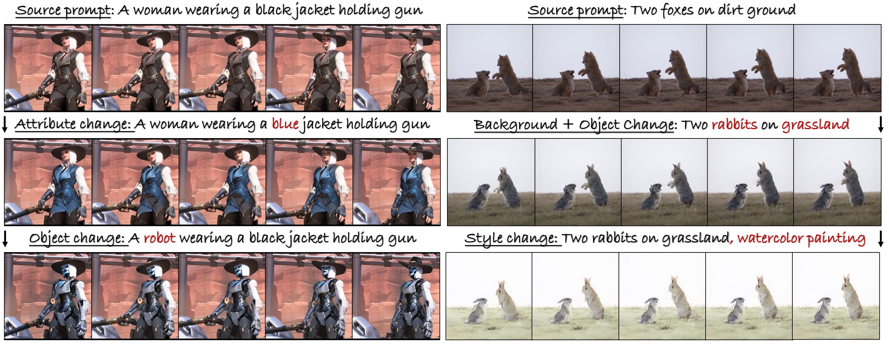

# FastVideoEdit: Leveraging Consistency Models for Efficient Text-to-Video Editing
  

This repository contains the implementation of *FastVideoEdit*. 

## Setup

> conda create -n fve python=3.10
> conda activate fve
> conda install  pytorch  torchvision  torchaudio  pytorch-cuda=12.1  -c  pytorch  -c  nvidia
> bash setup.sh
  

## Demos
  

### To reproduce teaser demos

> pythom run_demo.py --config_path configs/config_teaser_4_2.yaml

results will be saved in `./DemoDataset/ours_masa_pp_extend`.
  

### To run TGVE benchmark

Work in progress.